# Man-Utd

## User

- For a first time user I want the website to be eye catching in order for the person on the website to be encourage to contiue reading information

- A first time user should be able to navigate the website with ease and not struggle to find each page

- A user who comes back after their first time is a big positive as it shows that the information given towards them was good and gave them satisfaction

- If someone is frequently visiting the website it would be good if they took a following towards the football team 

- A regular visiter would be beneficial because they could find the website useful and mention it to their peers which would mean more people are viewing the website.

## Credits
+ Main Page
- [Image] (https://manunitedcore.com/premier-league-announce-manchester-uniteds-jam-packed-festive-schedule-27102023/)
+ Contact Page
- [Image] (https://www.pinterest.co.uk/pin/590041988664995659/)
- [Image] (https://www.pinterest.co.uk/pin/586805026420360561/)
- [Image] (https://www.cbc.ca/sports/soccer/manchester-united-wins-europa-league-1.4130117)

+ History Page

- [Image] (https://groundhopperguides.com/guide-leagues-cups-english-football/)
- [Image] (https://manchestersightseeingtours.com/tour/manchester-united-tour/manchester-united-football-club-mufc-trophies-manchester-united-football-club-limited/)
+ Response Page
- [Image] (https://www.pinterest.co.uk/pin/590041988664995659/)
- [Image] (https://www.pinterest.co.uk/pin/586805026420360561/)
- [Image] (https://www.cbc.ca/sports/soccer/manchester-united-wins-europa-league-1.4130117)

- I got help with my footer from my [Love Running Project](https://github.com/oscarbutler/Love-Running)

- In my testing I got help with the structure of the form from my mentors [work](https://github.com/IuliiaKonovalova/animal_shelter/blob/main/TESTING.md)

## Home Page

- I have made the background of the home page the stadium of Manchester United which is called Old Trafford. This is a very important piece of the club as it is one of the most iconic stadiums in football history. 

- Due to it being called the home page I put the stadium as that is the home of the club.

[Home](documentation/home-page.png)

## History Page
- I have chosen to make a page on the history of the club Manchester United due to the fact that it is a vital reason to why it has one the biggest fanbases in every sport.

[History](documentation/history-page.png)

## Contact Page

- A contact page was important as it allows the users to give feedback to potentially give feeback about the website or give more information that would be useful to have about the club.

- In the contact segment I have created a form which has three parts. These parts include name, email address and a question.

- After completing the form it will direct you to the response page.

[Contact](documentation/contact-page.png)

## Response Page

- A resposne page is very important so it allows the person who have left a question in the contact page to be directed here and it will let them know thta they will  be contacted with the answer to their question.

[Response](documentation/response-page.png)

## Header

- The header contains a navigation system which allows you to efficiently go through the website.

- The header is also visible with the navigation bar being easy to acces on mobile as well.

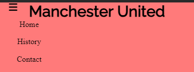

## Footer
- The footer contains four different social media pages which can be open a link to each website when clicked on.

- The footer is very clear and easy to see for the user of the website

- The social media links will take you to the website with ease which is vital for a footer

## Design

### Font
- I have used a font from [Google fonts](https://fonts.google.com/)

### Color
- I have mainly used a light red because red is the color of the football club I have made this website on. I have used a lighter red rather then a darker one since it is easier to look at for a longer duration of time and more appealing.

- White and black is also recurring colors since it is very easy to see and bold which is important when reading information.

## Technology Used

- CSS
- HTML
- Codeanywhere
- Github

## Navigation Bar
- I have created a navigation bar in order to let people using the website to maneouver and easily access multiple pages.
- There will be three pages that are available to view which include:
- Home page
- History
- Contact

- The navigation bar is clear and easy to see as it is the same color as the header. The color of the text is black on a light red/pink background which will be very easy to see.
 
 
 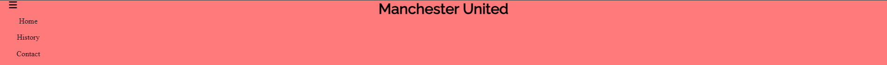
 
 ## Wireframes

 ### Mobile Device

 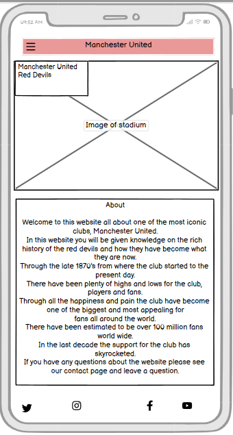

 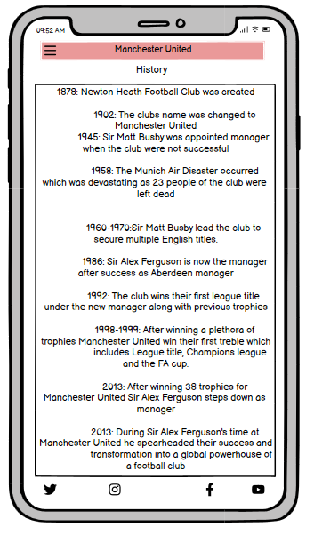

 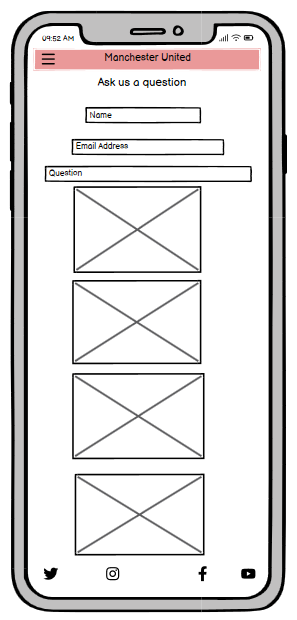

 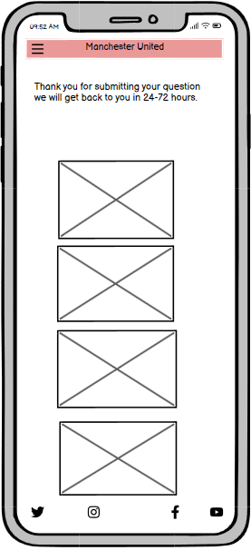

 ### Tablet Device

 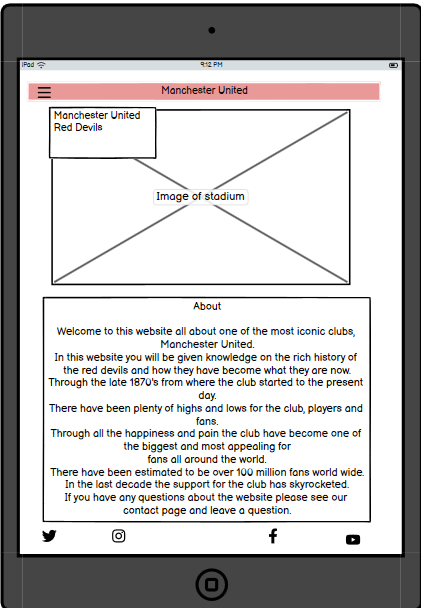

 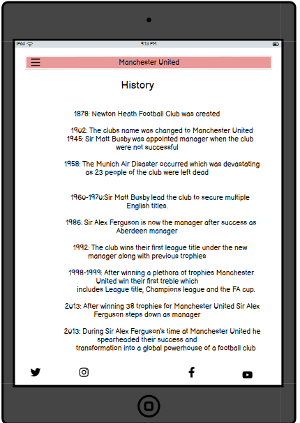

 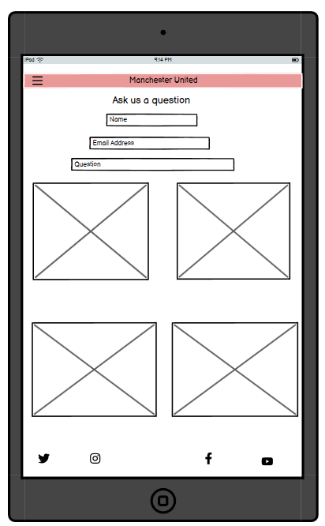

 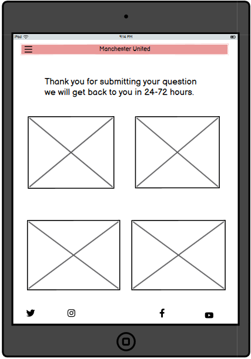

 ### Desktop Device

 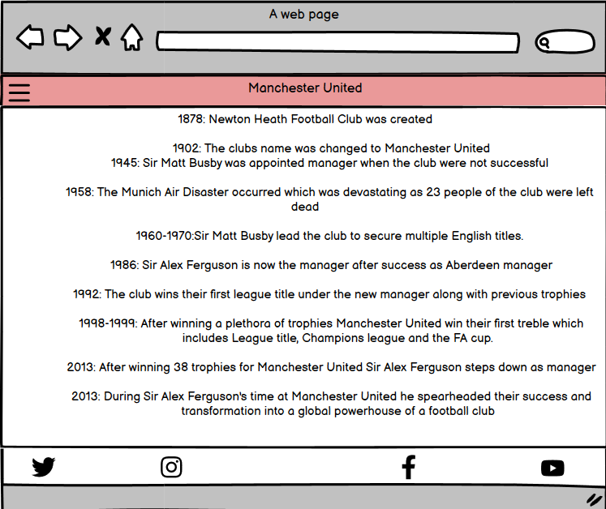

 

 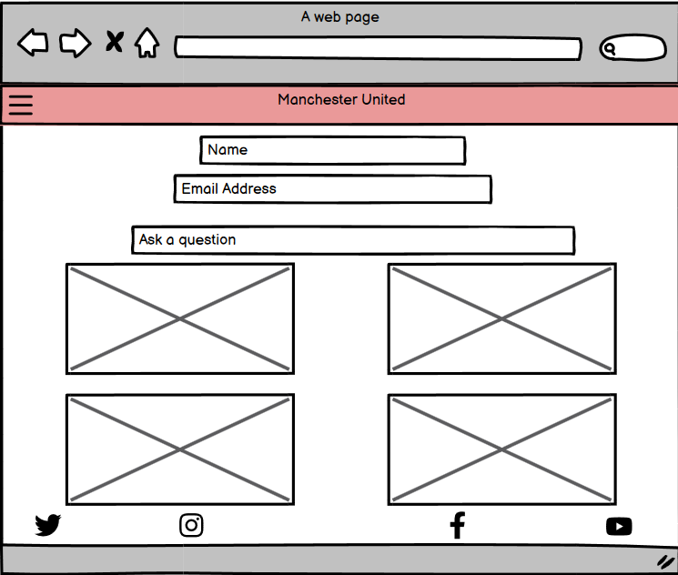

 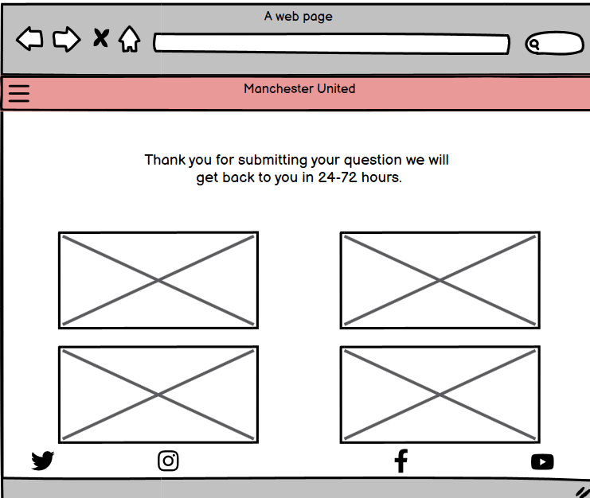 

## Deployment

The website that this was deployed to was Github. There various files all containing different parts of the website which is important.
There are five files that are vital are:
- index.html
- history.html
- contact.html
- response.html
- style.css