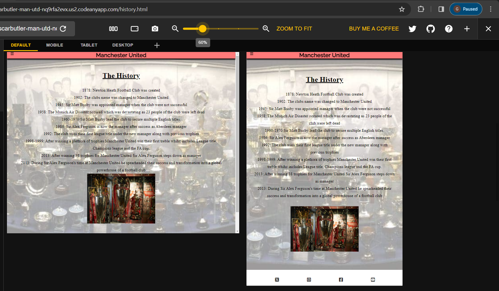

# Testing

## Responsiveness

The responsiveness of these website pages were tested by [Responsive Viewer](https://chrome.google.com/webstore/detail/responsive-viewer/inmopeiepgfljkpkidclfgbgbmfcennb)

### Home Page

### History Page

### Contact Page

### Response Page

## Manual Testing

| feature | action | expected result | tested | passed | comments |
| --- | --- | --- | --- | --- | --- |
| Navbar | | | | | |
| Home | Click on the "Home" link | The user is redirected to the main page | Yes | Yes | - |
| History | Click on the "History" link | The user is redirected to the history page | Yes | Yes | - |
| Contact | Click on the "Contact" link | The user is redirected to the contact page | Yes | Yes | - |
| Footer | | | | | |
| Instagram icon in the footer | Click on the Instagram icon | The user is redirected to the Instagram page | Yes | Yes | - |
| Facebook icon in the footer | Click on the Facebook icon | The user is redirected to the Facebook page | Yes | Yes | - |
| Twitter icon in the footer | Click on the Twitter icon | The user is redirected to the Twitter page | Yes | Yes | - |
| YouTube icon in the footer | Click on the YouTube icon | The user is redirected to the YouTube page | Yes | Yes | - |
| Home page | | | | | |
| History page | | | | | |
| Contact page | | | | | |
| Name input | Enter the name | The name is entered | Yes | Yes | If user doesn't enter the name, the error message appears |
| Email input | Enter the email | The email is entered | Yes | Yes | If user doesn't enter the email, the error message appears. If user enters not valid email, the error message appears |
| "Submit" button | Click on the "Submit" button | The user is redirected to the response page | Yes | Yes | - |
| Response page | | | | | |
| Response message | The user will be shown a message about when they will be contacted | The user will see the message | Yes | Yes | - |

()
## Performance

In the devtools I used the lighthouse report to test the websites performance

(documentation/sc-homepage-performance)

(documentation/sc-history-performance)
documentation/sc-content-performance

(documentation/sc-response-performance)

## Bugs

### Solved Bugs

- The lighthouse performance rating was too low due to the size of the photos being too big.

* Solution

- I found new images which sizes were a lot smaller which made the website load time a lot more efficient

### Unsolved Bugs

### Mistakes

- At the start of this project I found myself often using past tense in my commits which I made sure I would not repeat in the future.

- At the start I also did not specify which file I was commiting and instead comitted them all which made it very deifficult to read the progress I made over time.

## HTML Check

### Home Page

(documentation/index-html-checl.png)

### History Page

(documentation/sc-history-check.png)

### Content Page

(documentation/sc-contact-check.png)

### Response Page

(documentation/sc-response-check.png)

## CSS Check

(documentation/sc-style-check.png)