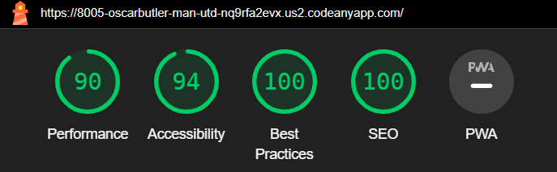

# Testing

## Compatability

The different browsers I have chosen to use are Google Chrome, Microsoft Edge and Firefox

This shows that the website is comaptable to a variety of browsers since it is all the same image

## Responsiveness

The responsiveness of these website pages were tested by [Responsive Viewer](https://chrome.google.com/webstore/detail/responsive-viewer/inmopeiepgfljkpkidclfgbgbmfcennb)

### Home Page

### History Page

### Contact Page

### Response Page

## Manual Testing

| feature | action | expected result | tested | passed | comments |
| --- | --- | --- | --- | --- | --- |
| Navbar | | | | | |
| Home | Click on the "Home" link | The user is redirected to the main page | Yes | Yes | - |
| History | Click on the "History" link | The user is redirected to the history page | Yes | Yes | - |
| Contact | Click on the "Contact" link | The user is redirected to the contact page | Yes | Yes | - |
| Footer | | | | | |
| Instagram icon in the footer | Click on the Instagram icon | The user is redirected to the Instagram page | Yes | Yes | It should open the link in another tab or page |
| Facebook icon in the footer | Click on the Facebook icon | The user is redirected to the Facebook page | Yes | Yes | It should open the link in another tab or page |
| Twitter icon in the footer | Click on the Twitter icon | The user is redirected to the Twitter page | Yes | Yes | It should open the link in another tab or page |
| YouTube icon in the footer | Click on the YouTube icon | The user is redirected to the YouTube page | Yes | Yes | It should open the link in another tab or page |
| Home page | | | | | |
| History page | | | | | |
| Contact page | | | | | |
| Name input | Enter the name | The name is entered | Yes | Yes | If user doesn't enter the name, the error message appears |
| Email input | Enter the email | The email is entered | Yes | Yes | If user doesn't enter the email, the error message appears. If user enters not valid email, the error message appears |
| "Submit" button | Click on the "Submit" button | The user is redirected to the response page | Yes | Yes | - |
| Response page | | | | | |
| Response message | The user will be shown a message about when they will be contacted | The user will see the message | Yes | Yes | - |

## Performance

In the devtools I used the lighthouse report to test the websites performance

## Bugs

### Solved Bugs

- The lighthouse performance rating was too low due to the size of the photos being too big.

* Solution

- I replaced the images but also had to delete one which went against my plans I made at the start.

### Unsolved Bugs

- None

### Mistakes

- I did not add style to body and main elements from the start which made it harder to create an appealing website

- At the start I also did not specify which file I was commiting and instead comitted them all which made it very deifficult to read the progress I made over time

## HTML Check

### Home Page

### History Page

### Content Page

### Response Page

## CSS Check

